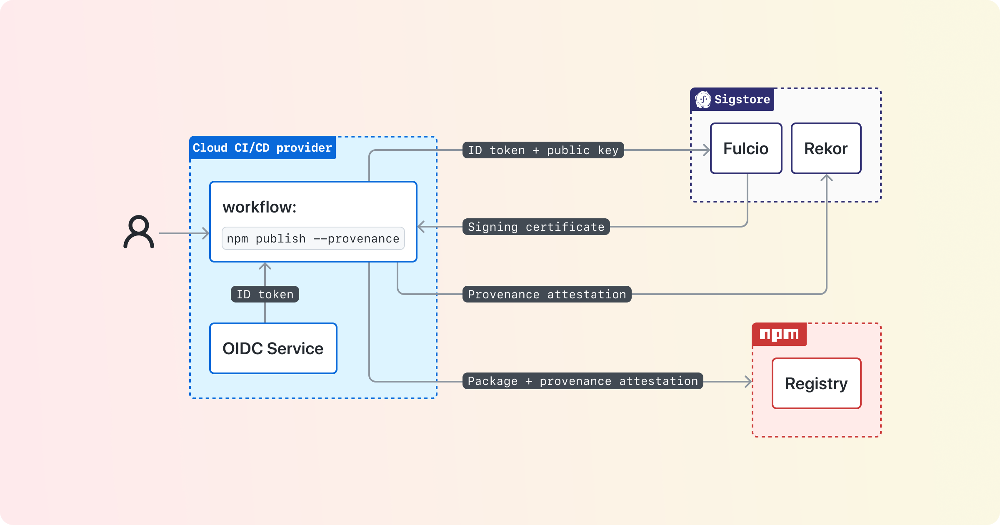

# Build Provenance for All Package Registries

There's a new security capability that registries can offer - build provenance - which verifiably links a package back to its source code and build instructions. Since these links are publicly available, package consumers can verify the package contains what it says, instead of having to trust that the build process or source code wasn't compromised.

## Why Build Provenance

**The goal is to have packages be transparent about their contents.** Many packaging systems today allow maintainers to manually specify links to their source code, but there's no guarantee the provided information is what was actually used in producing that package. Build provenance ensures these links both exist and are non-falsifiable. Note that this doesn't mean a package with build provenance is _inherently_ secure or trustworthy; just that those links do exist. Package consumers still need to follow those links to make their own determination of trustworthiness, either through manual inspection or other policies.

## How Build Provenance Works

Producing build provenance is a collaboration between a cloud CI/CD provider, a public-good signing service called [Sigstore](https://www.sigstore.dev/how-it-works), and a package registry (like npm):

At a high level, the cloud CI/CD system enforces the source code and build instructions used to build the package, and provides that information in a signed OIDC token. Those build properties are then sent to Sigstore, which both enables signing without requiring individual packages to manage keys, as well as provide a public transparency log for auditing purposes. The build provenance signed by Sigstore is then sent to the registry on package upload, and served to users when they consume a package.

## Resulting Design Decisions

Before we walk through the implementation in more detail, let's talk through several design decisions that come from the goal of packages being transparent about their contents.

For provenance to provide strong security guarantees, it requires using a build system that can:

- Run a build in an isolated, ephemeral environment
- Securely communicate the build properties to the registry, in a way the build instructions themselves cannot tamper with

These requirements mean you won't be able to generate trustworthy build provenance anywhere, like on a personal development machine. That's okay! Because some package registries have a mandate that anyone be able to publish new content quickly, **we do not recommend registries _require_ build provenance for all packages**. Instead, we encourage maintainers to think of build provenance as an important step of maturity for open source projects. You should add build provenance to your project as you grow and alongside other steps of maturity, like adding formal contribution rules, enumerated responsibilities for maintainers, or setting up a security vulnerability reporting policy.

Instead, we recommend that **builds take place on cloud CI/CD systems** that are able to provide isolation, ephemeral runners, and signed build metadata that the build cannot tamper with. The information from these cloud CI/CD systems are sent to Sigstore's Fulcio component. You can see what cloud CI/CD systems Fulcio trusts at <https://github.com/sigstore/fulcio/tree/main/federation>, and you can see what information those cloud CI/CD systems must provide at <https://github.com/sigstore/fulcio/blob/main/docs/oid-info.md#requirements-to-support-signing-with-cicd-workload-identities>.

Note that **build provenance does not try to tie a package back to a verified human identity**. Instead we're focusing on the workload identity from the build system, as that is what produces the package. Strongly authenticating humans and trying to determine their intent is a complex problem space that is out of scope for build provenance!

As of April 2023, there is a [public beta of build provenance in npm](https://github.blog/2023-04-19-introducing-npm-package-provenance/). We'll cover how npm implemented this functionality, and use that to frame how to add provenance to other registries.

# npm build provenance

Again, here's a high-level diagram of how build provenance works:

Let's break this down into a couple of parts:

- Collecting information from the cloud CI/CD system
- Extending the registry to support build provenance
- Supplying build provenance to users for verification

# Collecting information from the cloud CI/CD provider

You will need something reusable that the build process can call to get the information from the CI/CD provider, assemble it into a standard format, and then send that information to Sigstore and your registry.

We recommend building this functionality into a CLI tool. Most ecosystems already have some CLI tool involved in the package publishing process, and this allows the implementation to be shared across CI/CD providers.

For detailed technical specifications on assembling provenance and interacting with Sigstore services, see the [Sigstore Client Specification](https://docs.google.com/document/d/1kbhK2qyPPk8SLavHzYSDM8-Ueul9_oxIMVFuWMWKz0E/edit?usp=sharing). Here we'll go over a high-level description of the steps your tooling will follow (and take a look at [npm CLI's publish.js](https://github.com/npm/cli/blob/latest/workspaces/libnpmpublish/lib/publish.js) for a reference implementation):

If your registry supports private packages, the registry should check that you're working on a public package. This is because the build metadata will be published to Sigstore's transparency log, Rekor, which publishers of private packages might not want to make public.

Then we want to request an OIDC token that Sigstore Fulcio will accept. The registry should ensure you're on [CI/CD provider Fulcio supports](https://github.com/sigstore/fulcio/tree/main/federation), and if so, request an OIDC token with the audience set to "sigstore".

Next you'll construct the build provenance attestations. We recommend using [in-toto attestations](https://github.com/in-toto/attestation/blob/main/spec/README.md#in-toto-attestation-framework-spec) for formatting your attestation document, and [SLSA provenance](https://slsa.dev/provenance/v1) for the predicates in the in-toto attestation document. See [npm CLI's provenance.js](https://github.com/npm/cli/blob/latest/workspaces/libnpmpublish/lib/provenance.js) for a reference implementation, and note that there are [official in-toto protocol buffers for SLSA provenance](https://github.com/in-toto/attestation/blob/main/protos/in_toto_attestation/predicates/provenance/v1/provenance.proto).

Now you're ready to sign the package! You'll create an ephemeral key pair, and then send to Fulcio the OIDC token, your ephemeral public key, the OIDC subject signed with your private key (the “challenge value”), and the signature of your build artifact signed with your private key. See [sigstore-js' sign.ts](https://github.com/sigstore/sigstore-js/blob/main/packages/client/src/sign.ts#L110) for a reference implementation.

Fulcio will return to you a X.509 signing certificate, with the build provenance properties (including your public key) as OIDs in that certificate. You can now throw away your ephemeral private key.

But we aren't quite ready to send things to the registry - first you'll sign your build attestation document (with the Fulcio signing certificate) and publish it to Sigstore's Rekor to get a transparency log entry. You then create a Sigstore signature bundle with your signatures over your build artifact, the build attestation document, your transparency log entry, and a timestamp. This signature bundle will be sent to the registry when you publish the package.

You might be wondering how much of this Sigstore interaction you need to implement yourself. Ideally there would be a mature Sigstore library in a language supported by your ecosystem tooling. There are currently libraries for [JavaScript](https://github.com/sigstore/sigstore-js), [Go](https://github.com/sigstore/sigstore-go), [Python](https://github.com/sigstore/sigstore-python), as well libraries under development for [Rust](https://github.com/sigstore/sigstore-rs), [Ruby](https://github.com/sigstore/ruby-sigstore), and [Java](https://github.com/sigstore/sigstore-java). See [sigstore-conformance](https://github.com/sigstore/sigstore-conformance) to ensure client libraries are behaving as expected.

# Extending the registry to support build provenance

Now we're ready to publish the package to the registry. Traditionally, the publish request would be authorized using a long-lived shared secret, like an API key or a password. However, since the cloud CI/CD system now has an OIDC token containing the workload identity, we can authorize the publish request with a trust relationship based on the properties in the OIDC token. For an example of this, see <https://docs.pypi.org/trusted-publishers/>. In fact, registries can implement OIDC trust relationships to authorize publish requests without needing any support from Sigstore client libraries. So this is an excellent scoped project to start with, which is exactly what PyPI did.

Now that we have the package and the signed build attestation, we switch our focus to the registry and how it verifiers that information as it handles the publish request. See above for a discussion on what Sigstore libraries are available in what programming languages.

For a detailed description of how to verify the Sigstore bundle, see the [Verification section of the Sigstore Client Specification](https://docs.google.com/document/d/1kbhK2qyPPk8SLavHzYSDM8-Ueul9_oxIMVFuWMWKz0E/edit#heading=h.g11ovq2s1jxh). Additionally, the registry will want to verify that the bundle comes from a cloud CI/CD vendor it supports, and (of course) that the hash of the package matches what's recorded in the Sigstore bundle.

There's one last verification we recommend registries do - check to see if the previous version had provenance, and if so, see if the source code has a new URI (i.e. if the project moved to a new name, new organization, or a new source code provider). While this could be an indication of compromise, it could also be a normal evolution of a project. We recommend registries do not allow unexpected changes in provenance, however, they should provide package maintainers a way to indicate ahead of time that the package provenance is expected to change. Relatedly, we recommend registries not allow a package to publish without provenance after it has published with provenance - unless the maintainers have indicated ahead of time that they intend to no longer publish with provenance.

Additionally, we recommend the registry make a [`publish`](https://github.com/npm/attestation/tree/34f164c30ea75a364646e2439d9d1408bea57585/specs/publish/v0.1) attestation document and send it to Sigstore's Rekor. This creates an auditable public record of what packages have been published to the registry with provenance. For an example of a published attestation, see <https://search.sigstore.dev/?logIndex=20766332>. Note that this is \*not\* authenticated using an OIDC token or a Fulcio signing certificate; we recommend using a HSM-backed durable signing key, managed by the registry, for signing the publish attestation.

Once the bundle has been verified and the publish attestation publicly recorded, we can store the package and the Sigstore bundle for later use. The registry should maintain a one-to-one mapping between a package at a specific version and its associated provenance. It should retain that provenance for as long as it retains the associated package version.

# Supplying build provenance to users for verification

Generating build provenance is an important first step, but its value as a security capability is when we provide this information to users for them to verify and then use that information to make informed risk decisions.

When serving out build provenance, the registry should periodically ensure that the linked source code and build instructions still exist. If they do not, they should consider the package to no longer have provenance.

We recommend build provenance is served three ways: in the registry web UI, via an API call to the registry, and in CLI tooling.

The registry web UI should convey to consumers that a package has provenance, but **not** that it is automatically trustworthy. Remember, build provenance just provides links back to the source code and build instructions. Package consumers still need to follow those links to assess trustworthiness. We recommend providing literal links back to the source code, build instructions, and transparency log entry of the build provenance. Here is what that looks like on the npm registry:

The registry should also provide this information programmatically. We recommend that the registry add an API endpoint that includes the package name and the version to serve out the associated Sigstore bundle.

Last but not least, we recommend your CLI tooling provide a way to retrieve and verify provenance for a specific package. The CLI should retrieve build provenance from the registry API endpoint described above, and it should verify the bundle following the same procedure as when the registry receives a bundle, also described above. To determine what Sigstore library to use for your language ecosystem (you guessed it) see above.

# Summary

Adding build provenance to a registry is not a small undertaking, but it adds a major security capability in that packages can be transparent about what they contain and how they were built.

If you aren't sure where to start, we recommend skipping Sigstore entirely and instead focusing on allowing publish authorization via a cloud CI/CD system's OIDC token, like <https://docs.pypi.org/trusted-publishers/>. This will increase the security of your registry by not requiring people to store passwords or API keys in their build system, and introduce your users to the concept of OIDC tokens.

When you're ready to suggest your ecosystem provide build provenance with Sigstore, we have a few suggestions of points to emphasize:

- The goal is to have packages be transparent about their contents
- We do not recommend registries require build provenance for all packages
- Builds take place on cloud CI/CD systems
- Build provenance does not try to tie a package back to a verified human identity

When you go about planning your work, you'll need a library for generating and verifying Sigstore bundles. If at all possible, we recommend using an existing mature library with bindings. Then you can break up the work in terms of the CLI collecting information during the build, the registry verifying / storing / providing information, and the CLI retrieving and verifying the information when a package is being used.
